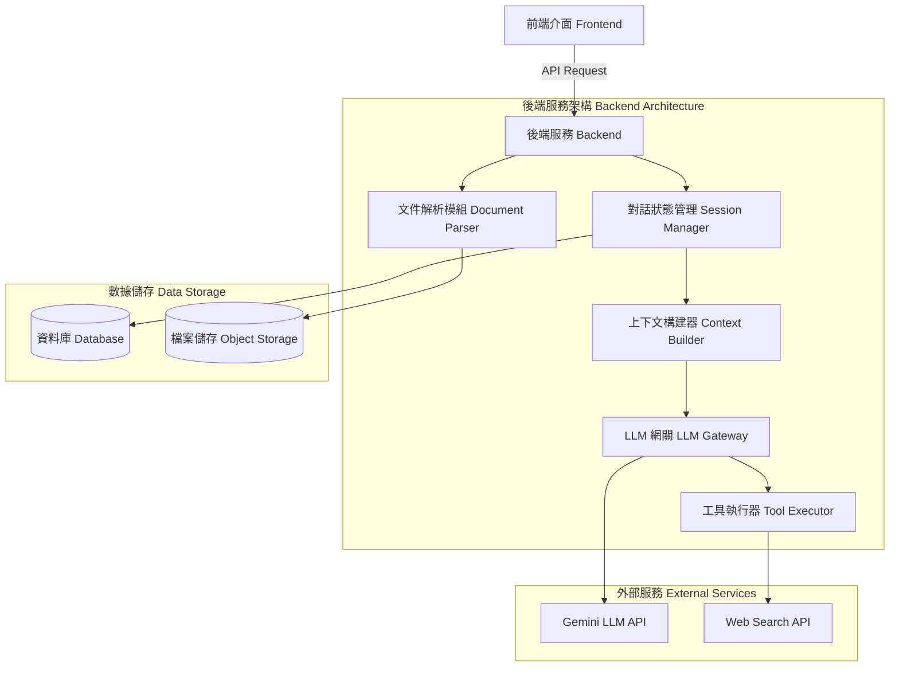

# 系統架構設計 (Architecture Design)

## 1. 系統總覽 (System Overview)

本系統為「AI 履歷顧問機器人」，採用經典的 Client-Server 架構，並高度整合 LLM (大型語言模型) 以實現多輪對話、文件解析與工具調用。

## 2. 核心模組說明 (Core Components)

### 2.1 前端介面 (Frontend)
- **Chat UI:** 呈現對話流 (Message list)，區分 User 與 Assistant 的對話泡泡。支援 Markdown 渲染以顯示格式化的履歷建議。
- **File Uploader:** 支援拖曳上傳 PDF、Word 或圖片，在上傳時提供進度條。
- **Session Sidebar:** 顯示過去的職缺修改紀錄 (歷史聊天室)，支援切換與建立新 Session。

### 2.2 後端服務 (Backend)
- **文件解析模組 (Document Parser):** 將使用者上傳的 PDF/Word 轉換為純文字，或將圖片進行前置處理後傳遞給多模態 LLM。
- **對話狀態管理 (Session Manager):** 負責 CRUD 聊天室 (Session) 與訊息 (Message)。根據 Session ID 撈取歷史對話紀錄。
- **上下文構建器 (Context Builder):** 在呼叫 LLM 前，將「System Prompt (SKILL.md)」、「用戶基礎資料 (Memory)」、「履歷與 JD 文本」以及「近期 N 輪對話歷史」組裝成符合 LLM API 格式的 payload。
- **LLM 網關與工具執行器 (LLM Gateway & Tool Executor):** 負責與 Gemini API 溝通。當 LLM 判斷需要使用工具時 (Function Calling)，觸發 Tool Executor 執行網頁搜尋，再將結果回傳給 LLM 繼續生成。

### 2.3 數據儲存 (Data Storage)
- **關聯式資料庫 (RDBMS):** 儲存 `Users` (用戶資料與偏好設定)、`Sessions` (對話主題)、`Messages` (單筆對話內容與角色)。
- **物件儲存 (Object Storage):** 儲存用戶上傳的原始履歷與 JD 檔案 (如 S3)。

## 3. 資料流與工作流程 (Data Flow)

### 3.1 建立新職缺對話 (Initialization Flow)
1. 用戶在前端點擊「新增履歷修改」，上傳履歷與 JD。
2. 後端 `Document Parser` 接收檔案並儲存至 `Object Storage`，同時提取純文字。
3. `Session Manager` 在資料庫中建立新的 Session 紀錄。
4. `Context Builder` 將提取的文字與 System Prompt 打包，發送給 `LLM Gateway` 進行初次分析。
5. LLM 回傳「差距分析與修改建議」，後端儲存為 Message 並推播給前端顯示。

### 3.2 多輪對話修改 (Iterative Chat Flow)
1. 用戶輸入修改指令 (例如：「縮短這段經歷」)。
2. 後端根據 Session ID 從資料庫撈出歷史對話 (Message History)。
3. `Context Builder` 將歷史紀錄與最新指令合併。
4. LLM 生成更新後的履歷段落，後端儲存並回傳前端更新畫面。

## 4. 技術選型 (Tech Stack)
- **Frontend:** 原生 HTML / Vanilla JavaScript / CSS (不使用 React 等大型前端框架)
- **Backend:** Python (FastAPI)
- **Database:** SQLite (輕量級關聯式資料庫，儲存結構化對話紀錄)
- **AI/LLM:** Google Gemini API (支援多模態輸入與 Function Calling)
