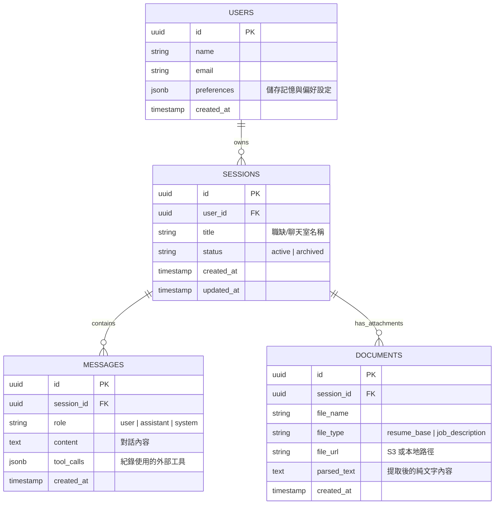

# 資料模型設計 (Data Models)

本文件定義「AI 履歷顧問機器人」系統後端資料庫（基於 SQLite）的核心 Schema 結構。

*註：由於使用 SQLite 作為本地資料庫，原邏輯設計中的 `UUID` 與 `JSONB` 欄位在實體資料庫中將以 `TEXT` 型別儲存，並由 Backend (FastAPI / ORM) 負責轉換。*

## 1. 實體關聯圖 (ER Diagram)

## 2. 資料表詳細規格 (Table Specifications)

### 2.1 Users (使用者表)
儲存求職者的基本資料與跨對話的「長期記憶」。

| 欄位名稱 (Column) | 型別 (Type) | 屬性 (Attributes) | 說明 (Description) |
| :--- | :--- | :--- | :--- |
| `id` | UUID | Primary Key | 系統唯一識別碼 |
| `email` | String | Unique, Not Null | 登入與聯絡信箱 |
| `name` | String | Not Null | 稱呼 |
| `preferences` | JSONB | Nullable | 儲存 AI 記憶的個人特質、年資、偏好語氣等。例如: `{"years_of_experience": 5, "preferred_tone": "confident"}` |
| `created_at` | Timestamp | Default: Now() | 建立時間 |

### 2.2 Sessions (對話聊天室)
每一個 Session 代表一次針對「特定職缺」的履歷修改專案。

| 欄位名稱 (Column) | 型別 (Type) | 屬性 (Attributes) | 說明 (Description) |
| :--- | :--- | :--- | :--- |
| `id` | UUID | Primary Key | 系統唯一識別碼 |
| `user_id` | UUID | Foreign Key | 關聯至 Users 表 |
| `title` | String | Not Null | 系統根據第一句話或上傳的 JD 自動生成的標題，例如「Google 前端工程師」 |
| `status` | String | Default: 'active' | 狀態 (active 進行中, archived 封存) |
| `created_at` | Timestamp | Default: Now() | 建立時間 |
| `updated_at` | Timestamp | Default: Now() | 最後互動時間 (用於側邊欄排序) |

### 2.3 Messages (對話訊息)
儲存多輪對話的內容，為 LLM Context Builder 提供對話歷史 (History)。

| 欄位名稱 (Column) | 型別 (Type) | 屬性 (Attributes) | 說明 (Description) |
| :--- | :--- | :--- | :--- |
| `id` | UUID | Primary Key | 系統唯一識別碼 |
| `session_id` | UUID | Foreign Key | 關聯至 Sessions 表 |
| `role` | String | Not Null | 訊息來源角色：`user` (求職者), `assistant` (AI), 或 `system` (系統提示) |
| `content` | Text | Not Null | 訊息主體文字 (AI 的回應包含 Markdown 格式的履歷建議) |
| `tool_calls`| JSONB | Nullable | 若 AI 在該回合呼叫了外部工具 (如網頁搜尋)，紀錄其執行參數與結果。 |
| `created_at` | Timestamp | Default: Now() | 發送時間 (排序依據) |

### 2.4 Documents (上傳文件)
儲存用戶上傳的履歷 (Resume) 或職缺描述 (JD)，供 AI 讀取。

| 欄位名稱 (Column) | 型別 (Type) | 屬性 (Attributes) | 說明 (Description) |
| :--- | :--- | :--- | :--- |
| `id` | UUID | Primary Key | 系統唯一識別碼 |
| `session_id` | UUID | Foreign Key | 關聯至 Sessions 表 |
| `file_name` | String | Not Null | 原始檔案名稱 |
| `file_type` | String | Not Null | 文件類型：`resume_base` (原始履歷), `job_description` (職缺內容) |
| `file_url`  | String | Not Null | 實體檔案存放在 Object Storage (如 AWS S3) 的網址 |
| `parsed_text`| Text | Nullable | 後端文件解析模組提取出的純文字內容，方便直接送給 LLM 處理 |
| `created_at` | Timestamp | Default: Now() | 上傳時間 |
